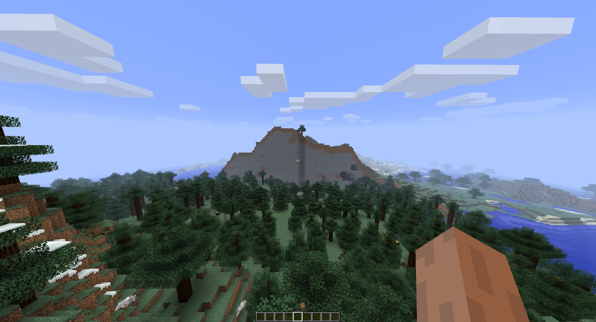
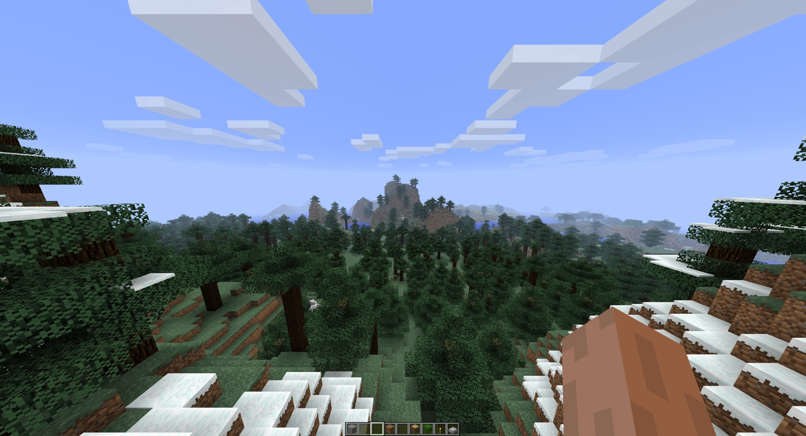
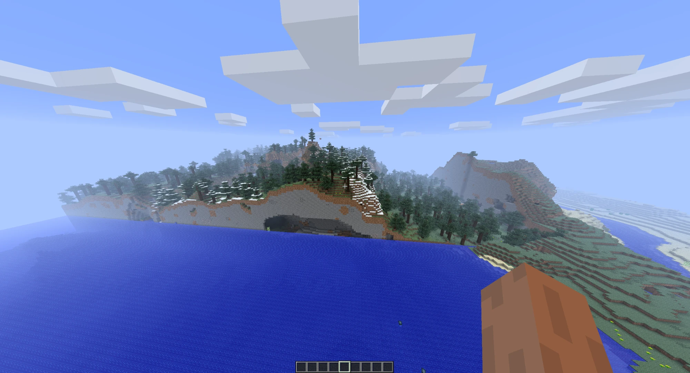
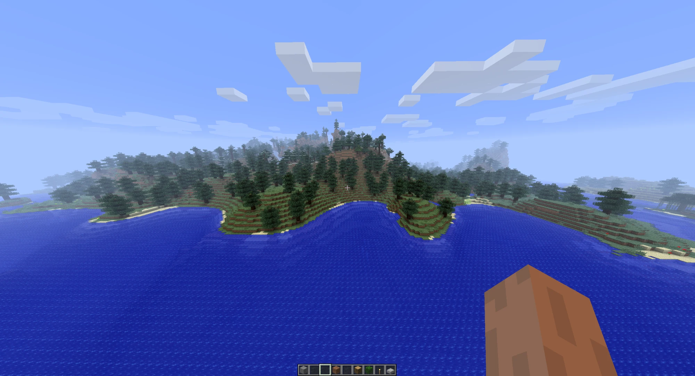
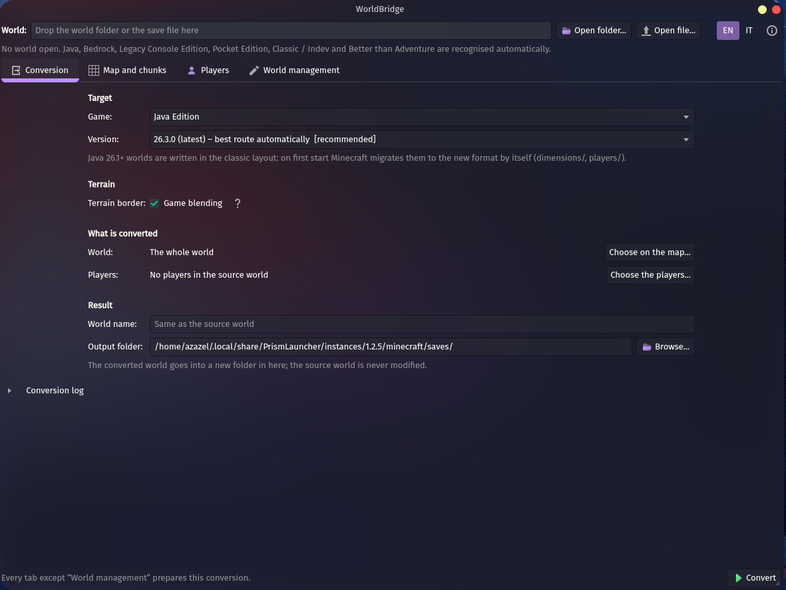
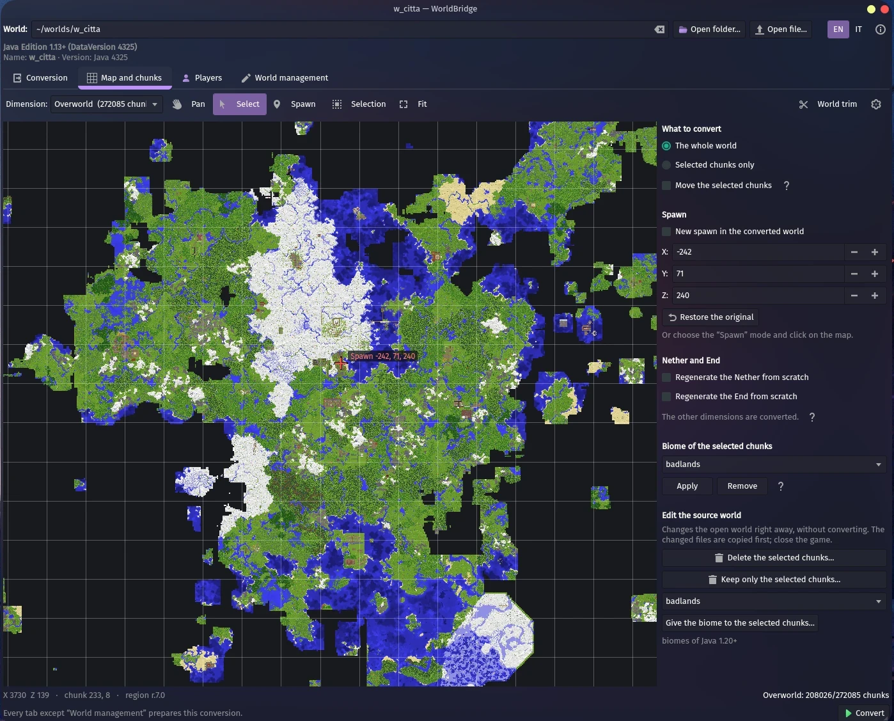
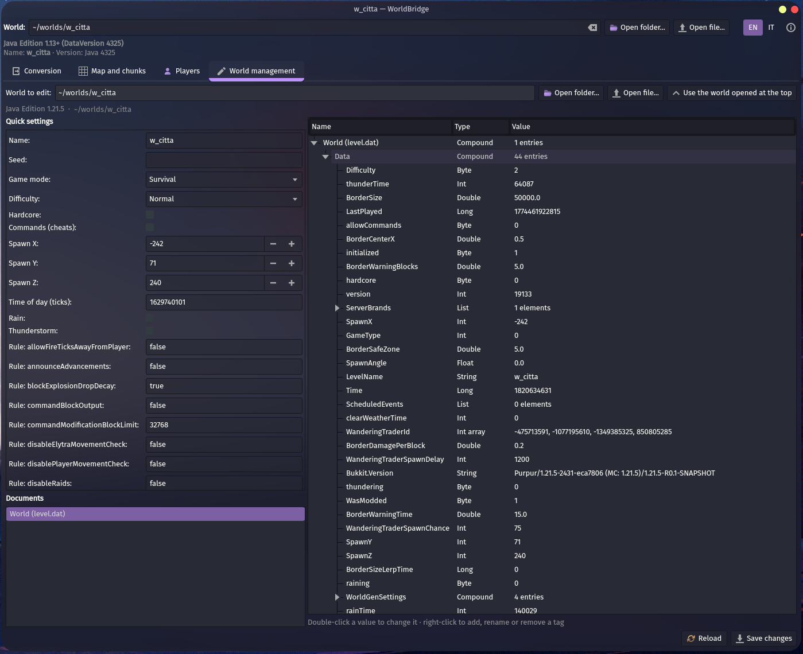

# WorldBridge


-green)

**A Minecraft world toolkit for Linux that converts between every edition: Java (Classic to 26.3),
Bedrock, Legacy Console Edition, Pocket Edition and Better than Adventure.** It also takes care of the
border between the converted world and the terrain the game generates next to it.

WorldBridge reads a world, converts blocks, chests, signs, entities and players, and writes the
target game's own format. Where the target does not blend old and new terrain, it writes a ring of
the target game's terrain around the converted world, generated with that game's own terrain
generator, reproduced block for block. It also has a map with chunk selection, world trim, in-place
chunk edits and an NBT editor. It runs from a single script, without installing anything on the
system.

> The interface and the command line are in English and Italian: switch with **EN | IT** at the top
> right of the window, or `--lang` on the command line.

> [!IMPORTANT]
> **WorldBridge 0.2.0 is an alpha, and this is its first public release.** Every figure below was
> measured, but there are more games, versions and saves than one person can test. **Always convert a
> copy of your world**, and please [report what you find](#help-test-it), whether it worked or not.
> Testers with real console saves (Xbox 360, PS3, Wii U, PS4, Xbox One, Switch) are especially
> wanted.

**The border, before and after.** A Java 26.3 world converted to Java 1.2.5. Without the ring, the
old game generates its own terrain right next to the converted world, leaving walls and cut caves.
With the ring, WorldBridge writes terrain from 1.2.5's own generator around the world, lifted to
meet it.

| Without the ring | With the ring |
|:---:|:---:|
|  |  |
|  |  |

## Contents

- [Highlights](#highlights)
- [Supported formats](#supported-formats)
- [What is converted](#what-is-converted)
- [Verified against the games](#verified-against-the-games)
- [Quick start](#quick-start)
- [Usage](#usage)
- [Speed](#speed)
- [Known limitations](#known-limitations)
- [Help test it](#help-test-it)
- [Documentation](#documentation)
- [Credits](#credits)
- [License](#license)

## Highlights

- **Every edition.** Java from Classic to 26.3, Bedrock 1.1 to 26.50, Legacy Console Edition on
  eight platforms and Pocket Edition 0.1 – 0.8, read and written; Classic, Indev and Better than
  Adventure 8.0.1 are read and converted to the others.
- **Nothing silently regenerated.** Every Java output is checked with Minecraft 26.3's own
  DataFixer: 0 chunks rejected across 81 outputs of the conversion matrix.
- **No seams at the border.**
  - Java and Bedrock 1.18+: chunks are written so that the game blends them itself.
  - Java Alpha 1.2 – 1.17 and neoLegacy: WorldBridge writes a ring of the game's own terrain,
    generated by that version's generator reproduced block for block and checked against worlds the
    game generated.
  - The Nether and the End get a 3D ring.
  - Small finite worlds are filled completely.
- **Terrain generators checked against the games.**
  - Beta 1.7.3: 98.7 % of the columns identical.
  - Java 1.7 – 1.12: biomes 100 %, air / water / rock 99.76 %.
  - neoLegacy: biomes 100 % on 301,736 columns.
  - Nether and End: 100 % identical to the jars' own generators.
- **Legacy Console Edition from the source.** The save container, the platform compressors (zlib,
  PS3 deflate, Xbox 360 LZX, Vita RLE), 4J's chunk storage and the Aquatic format are implemented
  from the 4J source. A real Windows64 save converts to itself identically.
- **Heights that fit.** 1.18+ worlds (y −64 to 319) go into games that start at y 0 or are 128 blocks
  high:
  - underground cut, kept, or kept from a chosen y;
  - mountains compressed instead of cut, with buildings and trees coming down whole.

  On an Amplified world, no block entity was lost.
- **Written for the target game.**
  - Old Java versions get only the NBT types and content they can read.
  - neoLegacy gets only the items, enchantments and entities in its source, and player files like
    the ones it writes.
  - LCE and Java ≤ 1.12 get chests paired so none is invisible.
- **Map and selection.**
  - A top-down map of any world, with MCA Selector-compatible chunk selections.
  - Move the selected chunks, paint biomes, set the spawn, choose players.
  - Trim unused chunks by `InhabitedTime`.
- **In-place editing.** Delete or keep chunks, paint biomes and edit any NBT document of Java,
  Bedrock, PE and LCE worlds, with automatic backups.
- **Every CPU core, the same result.** A multi-core conversion is identical, bit for bit, to a
  single-core one. The 18 test conversions went from 27.6 to 12.2 minutes.
- **No size limit of its own.** Measured on a world of 998,784 chunks: converted to Java in 7
  minutes with 0.63 GB of memory. Memory does not grow with the world in the steps that read it, and
  LCE / PE targets read only the chunks that reach their map.
- **Self-contained.** `./run.sh` brings a portable Python and prebuilt dependencies into the
  program's folder: no `sudo`, compilers or system packages. The interface follows the desktop's theme
  (Breeze, Kvantum, qt6ct, GNOME) and speaks English and Italian.

## Supported formats

| Edition | Read | Write |
|---|:---:|:---:|
| **Java** 26.x (new `dimensions/`, `players/data` layout) | ✅ | ✅ |
| **Java** 1.13 – 1.21.x | ✅ | ✅ (any version, exact) |
| **Java** 1.2 – 1.12.2 (numeric Anvil) | ✅ | ✅ |
| **Java** Beta 1.3 – 1.1 (McRegion) | ✅ | ✅ |
| **Java** Infdev, Alpha, Beta 1.0 – 1.2_02 | ✅ | ✅ (`World1` … `World5` slots) |
| **Java** Indev (`.mclevel`) | ✅ | – |
| **Java** Classic (`level.dat`, `.mine`, including the serialised format of 0.0.13a – 0.30) | ✅ | – |
| **Better than Adventure** 8.0.1 (a Beta 1.7.3 mod) | ✅ | – (converts to Java 26.3) |
| **Bedrock** 1.1 → 26.50 (LevelDB, `.mcworld`) | ✅ | ✅ |
| **Pocket Edition** 0.1 – 0.8 (`chunks.dat`) | ✅ | ✅ |
| **LCE** Windows64 (neoLegacy and the other PC ports, `saveData.ms`) | ✅ | ✅ (neoLegacy TU31) |
| **LCE** Xbox 360 (`savegame.dat`, CON packages; Xenia) | ✅ | ✅ (`savegame.dat`) |
| **LCE** PlayStation 3 (`GAMEDATA`; RPCS3) | ✅ | ✅ |
| **LCE** Wii U (Cemu), PS Vita (Vita3K), Switch | ✅ | ✅ |
| **LCE** PS4 / Xbox One (split saves `GAMEDATA_xxxxxxxx`) | ✅ | ✅ |
| **LCE** chunk formats: NBT (TU0–TU13), 4J compressed storage (TU14+), Aquatic V12 / V13 (TU69+) | ✅ | NBT and compressed |

## What is converted

- **Blocks**, with states and variants; blocks the target lacks become the closest one it has, never
  air.
- **Light and biomes**; biome ids are preserved 1:1.
- **Containers** with their contents, signs, spawners, beds, banners, heads, jukeboxes, flower pots,
  note blocks.
- **Entities**: mobs (owner, collar, saddle, name, baby, colour), dropped items, paintings, item
  frames with maps, minecarts, boats, armour stands.
- **Players**: position, inventory, armour, ender chest, experience, health, hunger, game mode.
  Players can be linked to a Java account (premium or offline), an LCE player id, or the Bedrock
  local player.
- **World data**: name, seed, world type (Amplified, Large Biomes), spawn, time, weather, game mode.
- **Maps**, including those in item frames.
- **Better than Adventure**: all 455 blocks, with painted woods mapped to vanilla woods (a
  configurable palette), statues as posed armour stands, and extra slots as dropped items that never
  despawn. See [BTA_BLOCK_MAPPING.md](docs/BTA_BLOCK_MAPPING.md).

## Verified against the games

WorldBridge's figures come from the games themselves:

- Minecraft 26.3's DataFixer, run outside the game.
- Each version's terrain generator, called from its jar with the same seed.
- Worlds generated by each version.
- Real saves.
- In-game tests.

Full tables: [VERIFICATION.md](docs/VERIFICATION.md).

| Check | Result |
|---|---|
| Conversion matrix: 18 source formats × 17 targets | 289 / 289 conversions succeed (17 pairs not applicable) |
| Java outputs through Minecraft 26.3's DataFixer | 0 chunks rejected |
| Real LCE Windows64 TU19 save (5,678 chunks) → LCE | identical to the original: blocks, light, biomes, height maps, entities, ticks, `level.dat`, players |
| Height maps of real LCE saves, recomputed from decoded blocks | 99.9 – 100 % equal to the game's |
| Alpha 1.2 – Beta 1.7.3 generator, 736 chunks of the game | 98.7 % of the columns identical block for block |
| 1.0 / 1.1 generators, 1,023 / 1,442 chunks | surface 99.0 % / 99.5 %, air / water / rock 99.8 % |
| 1.2 – 1.6, 1.7 – 1.12, 1.13 – 1.17 generators | biomes 100 %; air / water / rock 98.97 %, 99.76 %, 99.71 % |
| neoLegacy generator, 1,259 chunks | biomes 100 % (301,736 columns), ground 98.9 % |
| Nether and End generators, b1.8.1 – 1.16.5 | 100 % identical (2,817 chunks; 23,000 density columns bit for bit) |
| Biome stacks against cubiomes | identical on every tested seed, Large Biomes included |
| Ring outer edge | identical to the game's terrain (389,120 blocks) |
| Better than Adventure, 3,136 chunks | identical to the reference conversion, block for block |
| Chest pairing, 2,000 random groups | every chest visible, every content kept |
| Multi-core against single-core output | bit-identical |
| World of 998,784 chunks → Java 26.3 | 7 min, 0.63 GB of memory |
| Automated tests | 252 |

## Quick start

```bash
git clone https://github.com/zazazel456/WorldBridge.git && cd WorldBridge
./run.sh                                               # the interface
./run.sh convert <source> <output folder> --to java    # the command line
```

The first start takes about 20 seconds and 430 MB, all inside `.runtime/`. To uninstall, delete the
folder.

**Requirements:** Linux x86_64 with glibc ≥ 2.34 (Ubuntu 22.04, Debian 12, Fedora 35 or later),
`curl` or `wget`, and for the interface the OpenGL / EGL and fontconfig libraries every desktop has.

## Usage

**Interface.**

1. Drop a world folder or save file at the top of the window (or use **Open folder…** / **Open
   file…**). The format is recognised by itself.
2. Choose the target game and version in **Conversion**. Only the options that apply are shown.
3. Optionally, select chunks, move them, set the spawn or trim in **Map and chunks**, and choose
   players in **Players**.
4. Click **Convert** (Ctrl+Enter).

**World management** edits any world's NBT without converting it. **EN | IT** at the top right
switches the language at once, keeping every choice.

| Conversion | Map and chunks | World management |
|:---:|:---:|:---:|
|  |  |  |

The window follows the desktop's theme; these screenshots use KDE Plasma with a Kvantum theme.

**Command line.**

```bash
python -m worldbridge info     <path>
python -m worldbridge convert  <source> <output> --to java                        # latest Java, best route
python -m worldbridge convert  <source> <output> --to java --java-mode amulet --version 1.20.1
python -m worldbridge convert  <source> <output> --to bedrock --version 26.50.0
python -m worldbridge convert  <source> <output> --to lce --platform win64 --player-id <XUID>
python -m worldbridge convert  <source> <output> --to java --chunks base.csv --move-to center
python -m worldbridge trim     <world> <trimmed copy>
```

Every option, what each tab does, and where each game expects converted worlds are in the
[user guide](docs/USER_GUIDE.md).

## Speed

On a 4-core CPU:

| Conversion | Time |
|---|---:|
| LCE Windows64 → Java, upgraded by the game (8,179 chunks) | 7 s |
| Java 1.12 → LCE Windows64 with the ring (5,678 chunks) | 55 s |
| Java 26.3 → LCE Windows64 with the ring (1,252 chunks) | 46 s |
| Java 26.3 → Java 1.16 (Amulet) | 35 s |
| 998,784-chunk world → Java 26.3 | 7 min (2,390 chunks/s, 0.63 GB) |
| 998,784-chunk world → LCE Windows64, Large map | 2 min (only the chunks that reach the map are read) |
| Bedrock 26.50 → Java 26.3 (98,304 chunks) | 2 min 50 s |

More figures are in [VERIFICATION.md](docs/VERIFICATION.md#speed-and-large-worlds).

## Known limitations

- **Untested consoles.** Xbox 360, PS3, Wii U, PS4, Xbox One and Switch saves are implemented from
  the 4J source but have not been tested with files from those consoles yet. Windows64 and PS Vita
  were tested on real saves.
- **Aquatic chunks are read only.** LCE is written in the NBT and compressed chunk formats, which
  every version of the game loads.
- **Newer content is replaced or removed** on the way to older games; the report at the end lists
  what.
- **Entity data between editions.** Villager trades and very specific entity data pass only between
  LCE and Java and through Minecraft's own upgrade.
- **Not every target has a border remedy yet.** Bedrock 1.1 – 1.17, large LCE console maps and
  Customized Java worlds have none; the conversion warns.
- **Nether and End on Java and Bedrock 1.18+.** When converted from another generator or seed, they
  keep a step at the edge, because the game blends only the Overworld. *Regenerate* is available.
- **PE 0.8** keeps the player's position and health but not the inventory.
- **Better than Adventure** converts to Java 26.3 only.

The complete list, with reasons, is in the [test plan](docs/TEST_PLAN.md#known-limits-not-bugs).

## Help test it

WorldBridge is in alpha and is built to be checked against the games, so test reports are the most
useful contribution right now, including the ones where everything worked.

- **Conversion reports.** Convert a copy of a world, open it in the target game, and tell what you
  saw: [open a test report](https://github.com/zazazel456/WorldBridge/issues/new?template=test_report.yml).
- **Bugs.** Something lost, wrong or crashing:
  [open a bug report](https://github.com/zazazel456/WorldBridge/issues/new?template=bug_report.yml).
- **Console saves.** Xbox 360, PS3, Wii U, PS4, Xbox One and Switch saves are implemented from the
  formats but untested on real files. A save from one of these (or a report of converting into one)
  is worth more than any other test.
- **Distributions and desktops.** Did `./run.sh` start on yours? Tell which one, even if it did.
- **Code and translations.** Pull requests are welcome; read [CONTRIBUTING.md](CONTRIBUTING.md) first.

## Documentation

| Document | Contents |
|---|---|
| [User guide](docs/USER_GUIDE.md) | installation, every tab and option, command line, where to put converted worlds |
| [Technical overview](docs/TECHNICAL.md) | pipeline, routes, formats, content translation, heights, parallelism, theme |
| [Seamless borders](docs/SEAMLESS_BORDERS.md) | game blending, the ring, the 3D ring, the fill, and every generator |
| [Verification](docs/VERIFICATION.md) | methods and every measured figure |
| [Test plan](docs/TEST_PLAN.md) | how to test by hand, the museum world, known limits |
| [BTA block mapping](docs/BTA_BLOCK_MAPPING.md) | every Better than Adventure block and its Java 26.3 result |
| [Roadmap](docs/ROADMAP.md) | what is done and what comes next |
| [Fix history](docs/FIX_HISTORY.md) | problems found during development and how they were fixed |
| [Changelog](CHANGELOG.md) | what changed in each version |
| [Contributing](CONTRIBUTING.md) | how to test, report and send changes |
| [Credits](CREDITS.md) | third-party code, ported algorithms, libraries, sources and licences |
| [License](LICENSE) | PolyForm Noncommercial 1.0.0 |

**Running the tests:**

```bash
.runtime/python/bin/python3 -m pip install -q pytest   # after the first ./run.sh
.runtime/python/bin/python3 -m pytest -q tests          # 252 tests, about 5 minutes
.runtime/python/bin/python3 tools/matrix.py quick       # main paths, about 5 minutes
.runtime/python/bin/python3 tools/matrix.py full        # every source × every target, about 1 hour
```

## Credits

WorldBridge includes code from, ports algorithms of, and was checked against other projects:

- **Included code:** [LCEStudio](https://github.com/mrtitanic777/LCEStudio) (the Xbox 360 LZX codec).
- **Ported algorithms:**
  - [cubiomes](https://github.com/Cubitect/cubiomes) (biome layers);
  - the 4J Studios Legacy Console Edition source and [neoLegacy](https://git.neolegacy.dev/neoStudiosLCE/neoLegacy)
    (LCE formats, neoLegacy's generator and content tables).
- **Libraries:** [Amulet Core and PyMCTranslate](https://www.amuletmc.com/) (Java / Bedrock block
  translation), NumPy, PySide6.
- **Design and references:**
  - [MCA Selector](https://github.com/Querz/mcaselector) (the map and the selection format);
  - [Thanos](https://github.com/aternosorg/thanos) (trim rules);
  - LegacyEditor, libLCE, LCE-Save-Converter and the Team-Lodestone documentation (LCE formats);
  - Modern Beta (cross-checking the Beta generator);
  - the KDE Human Interface Guidelines.

Every source, with its licence, is listed in [CREDITS.md](CREDITS.md).

## How it was made

WorldBridge was written with the help of AI coding assistants. Every result in this README and in
[VERIFICATION.md](docs/VERIFICATION.md) comes from running the code against the games, their jars and
real saves, not from the assistant's word; where something is not verified yet, it says so.

## License

WorldBridge is released under the **[PolyForm Noncommercial License 1.0.0](LICENSE)**,
© 2026 [zazazel456](https://github.com/zazazel456). It is source-available: free for every
noncommercial use, but not open source in the OSI sense, because commercial use is excluded.

- **You may** use, copy, modify and share it, and publish your own versions, for any noncommercial
  purpose: personal use, hobby projects, study, and use by schools, charities, public research and
  government institutions.
- **You must** pass on, with any copy of any part of it, the licence (or its URL) and this line:

  ```
  Required Notice: WorldBridge, Copyright (c) 2026 zazazel456 (https://github.com/zazazel456/WorldBridge)
  ```
- **You may not** use it for commercial purposes: no selling it, and no selling repackaged or
  modified versions.

**Your worlds are yours.** As an additional permission, converting, trimming and editing your worlds
with WorldBridge is always a permitted use, and you may use the resulting worlds anywhere, commercial
uses included: monetized videos and streams, servers that charge for ranks or access, maps you sell.
What stays forbidden is selling WorldBridge itself, in any form, or charging others to run it for
them (for example a paid conversion service). This permission covers WorldBridge's own code; the
libraries it uses keep their own terms (see [CREDITS.md](CREDITS.md)).

Third-party code, libraries and data in this repository keep their own licences, listed in
[CREDITS.md](CREDITS.md).

Minecraft is a trademark of Mojang Synergies AB / Microsoft. WorldBridge is an unofficial tool, not
affiliated with or endorsed by Mojang, Microsoft or 4J Studios. No game code or files are included.
